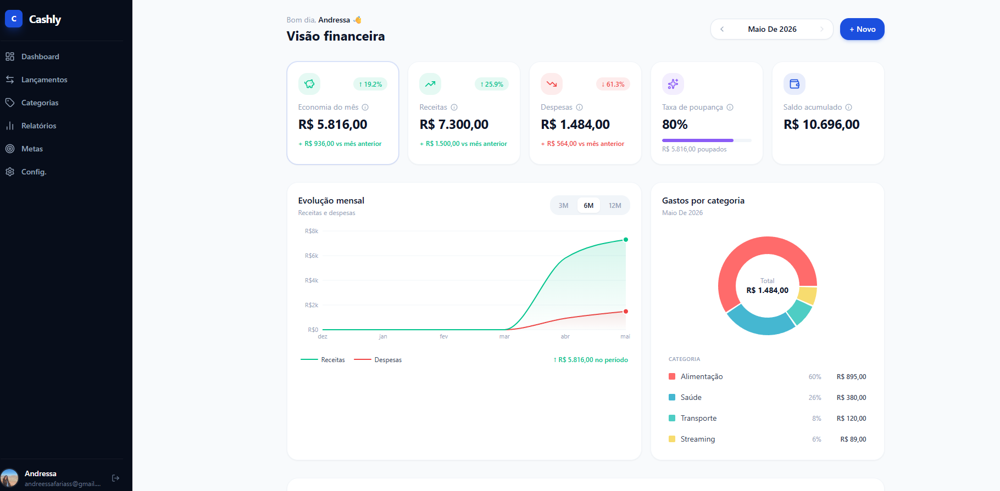
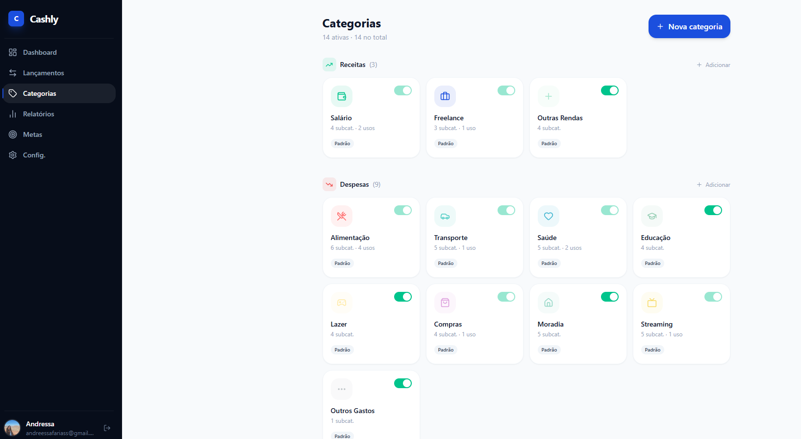
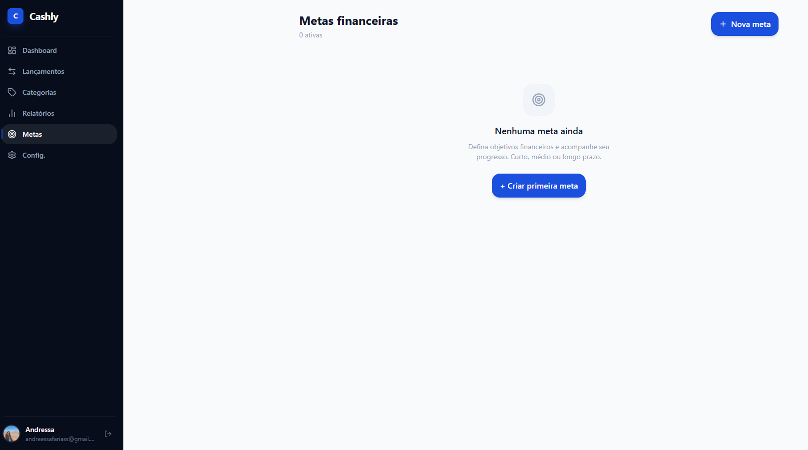

<div align="center">
  

  <h1>💰 Cashly</h1>
  <p>App de controle financeiro pessoal — moderno, intuitivo e open source.</p>

  <p>
    
    
    
    
    
    
  </p>

  <a href="https://cashly-drab.vercel.app/" target="_blank">
    
  </a>
</div>

---

## 📸 Screenshots

<div align="center">
  
  
  
  
</div>

---

## 🚀 Sobre o projeto

O **Cashly** é um app de controle financeiro pessoal desenvolvido como projeto de portfólio, aplicando os aprendizados da pós-graduação em **UX Engineering (PUC Minas)** e da formação em **React + TypeScript (Alura)**.

O objetivo foi construir um produto real — com pesquisa de usuário, design system, código limpo e deploy em produção — do zero até o deploy.

---

## ✨ Funcionalidades

- 🔐 **Autenticação** com Google via Firebase
- 📊 **Dashboard** com visão financeira completa — saldo, receitas, despesas, taxa de poupança
- 📈 **Gráficos** de evolução mensal e gastos por categoria
- 💸 **Lançamentos** com busca, filtros por período, tipo e categoria
- 🏷️ **Categorias** personalizáveis com ícones e subcategorias
- 🎯 **Metas financeiras** com acompanhamento de progresso
- 📱 **Responsivo** — sidebar no desktop, bottom nav no mobile

---

## 🛠 Stack

| Tecnologia | Uso |
|---|---|
| React 18 + TypeScript | Interface e tipagem |
| Vite | Build tool |
| Tailwind CSS | Estilização |
| Zustand | Gerenciamento de estado |
| Firebase Auth | Autenticação Google |
| Recharts | Gráficos e visualizações |
| React Router v6 | Navegação |
| Zod | Validação de formulários |
| Lucide React | Ícones |

---

## 🎓 UX Engineering aplicado

Este projeto aplica práticas da pós-graduação em UX Engineering:

- **Pesquisa com usuários reais** — formulário Google Forms com personas baseadas em dados
- **Personas documentadas** — Elvis (usuário avançado) e Fernanda (usuária iniciante)
- **User Journey Maps** — jornada completa mapeada no Miro para cada persona
- **Design System** — tokens de design, componentes Atomic Design (atoms, molecules, organisms)
- **Acessibilidade** — aria-labels, navegação por teclado, contraste WCAG
- **Processo documentado** em `docs/` — pesquisa, wireframes e design system

---

## ⚡ Como rodar localmente

```bash
git clone https://github.com/andressafs27/cashly.git
cd cashly
npm install
npm run dev
```

> Necessário configurar as variáveis do Firebase em `src/services/firebase.ts`

---

## 🗺 Roadmap

- [x] Sprint 0 — UX Research, Personas, Journey Maps
- [x] Sprint 1 — Setup, Design System, Arquitetura
- [x] Sprint 2 — Autenticação e Layout base
- [x] Sprint 3 — CRUD de Lançamentos
- [x] Sprint 4 — Categorias e Filtros
- [x] Sprint 4 — Dashboard e Gráficos
- [ ] Sprint 5 — Metas Financeiras ← em andamento
- [ ] Sprint 6 — Relatórios e Export PDF
- [ ] Sprint 7 — Testes, Dark Mode, CI/CD
