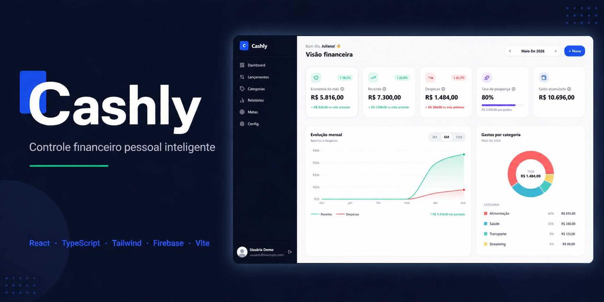

<div align="center">
  
</div>
<div align="center">

<br />

<p>
  
  
  
  
  
  
</p>

<p>
  
  
  
</p>

</div>


---

## 🛠 Stack

| Categoria | Tecnologia | Versão | Uso |
|---|---|:---:|---|
| **Core** | [React](https://react.dev/) | 18 | Interface e componentização |
| | [TypeScript](https://www.typescriptlang.org/) | 5 | Tipagem estática e segurança |
| | [Vite](https://vitejs.dev/) | 5 | Build tool moderno |
| **UI** | [Tailwind CSS](https://tailwindcss.com/) | 3 | Estilização e Design Tokens |
| | [Lucide React](https://lucide.dev/) | — | Ícones acessíveis |
| | [class-variance-authority](https://cva.style/) | — | Variantes de componentes |
| **Estado** | [Zustand](https://zustand-demo.pmnd.rs/) | 4 | Estado global com persistência |
| | [React Router](https://reactrouter.com/) | 6 | Navegação SPA |
| **Backend** | [Firebase](https://firebase.google.com/) | 10 | Autenticação Google |
| **Gráficos** | [Recharts](https://recharts.org/) | 2 | Gráficos responsivos e interativos |
| **Qualidade** | [Zod](https://zod.dev/) | 3 | Validação de formulários type-safe |
| | ESLint + Prettier | — | Qualidade e consistência de código |
| | [date-fns](https://date-fns.org/) | — | Manipulação de datas em pt-BR |
| **Deploy** | [Vercel](https://vercel.com/) | — | CI/CD e hospedagem em produção |

## 🎓 UX Engineering na prática

Este projeto aplica os aprendizados da pós-graduação em **UX Engineering (PUC Minas)** — do research ao código.

---

### 🔍 Pesquisa com usuários reais

Antes de escrever qualquer linha de código, foi realizada uma pesquisa estruturada com usuários reais via Google Forms com 10 perguntas sobre hábitos financeiros, dificuldades com apps e expectativas.

**Os dados geraram 2 personas baseadas em evidências:**

| | João | Fernanda |
|---|---|---|
| **Perfil** | Programador, 34 anos | Escriturária, 25 anos |
| **Tipo** | Usuário avançado | Usuária iniciante |
| **Principal dor** | Apps só registram, não orientam | Apps são complicados demais |
| **Principal desejo** | Insights automáticos e relatórios detalhados | Simplicidade e clareza visual |

📂 Documentação completa em [`docs/research/personas/`](./docs/research/personas)

---

### 🗺️ User Journey Maps

Jornadas completas mapeadas no Miro para cada persona, cobrindo as fases:
Descoberta → Registro → Integração → Uso diário → Resultado
Para cada fase foram mapeados: ações, necessidades, ponto de contato, sentimento, bastidores e oportunidades de melhoria.

📂 [`docs/research/journey/`](./docs/research/journey)

---

### 🧩 Atomic Design

Arquitetura de componentes organizada em camadas com responsabilidade única:

atoms → Button, Input, Badge, Icon
molecules → TransactionCard, CategoryChip, GoalProgress
organisms → TransactionList, DashboardChart, GoalCard
templates → AppLayout (sidebar + bottom nav)
pages → Dashboard, Lançamentos, Categorias, Metas, Relatórios

---

### ♿ Acessibilidade (WCAG 2.1 AA)

- `aria-label` em todos os elementos interativos sem texto visível
- Navegação completa por teclado — `Tab`, `Enter`, `Esc`, setas
- Contraste de cores validado — mínimo 4.5:1 para texto normal
- `aria-live` nas notificações e toasts dinâmicos
- `role` e foco gerenciado em todos os modais e drawers

---

### 📐 Heurísticas de Nielsen aplicadas

| Heurística | Como foi aplicada no Cashly |
|---|---|
| **Visibilidade do status** | Loading states e feedback visual em todas as ações |
| **Controle do usuário** | Confirmação antes de excluir, botão cancelar sempre presente |
| **Consistência** | Mesmo padrão visual e de interação em todos os formulários |
| **Prevenção de erros** | Validação com Zod antes de qualquer submissão de formulário |
| **Flexibilidade** | Filtros rápidos por preset E seletor de período customizado |
| **Design minimalista** | Interface sem elementos desnecessários, foco no conteúdo |

## ⚡ Como rodar localmente

**Pré-requisitos:** Node.js 18+ e npm

```bash
# 1. Clone o repositório
git clone https://github.com/andressafs27/cashly.git

# 2. Entre na pasta
cd cashly

# 3. Instale as dependências
npm install

# 4. Inicie o servidor de desenvolvimento
npm run dev
```

Acesse **`http://localhost:5173`** no navegador.

> ⚠️ Para autenticação com Google, configure suas credenciais do Firebase em `src/services/firebase.ts`

**Outros comandos disponíveis:**

```bash
npm run build    # Build de produção
npm run lint     # Verificar qualidade do código
npm run preview  # Visualizar o build de produção localmente
```
## 🗂 Estrutura do projeto

```
cashly/
├── src/
│   ├── assets/                  # Logo, ícones, fontes
│   ├── components/
│   │   ├── atoms/               # Button, Input, Badge, Icon
│   │   ├── molecules/           # TransactionCard, CategoryChip, GoalProgress
│   │   ├── organisms/           # TransactionList, DashboardChart, GoalCard
│   │   └── templates/           # AppLayout (sidebar + bottom nav)
│   ├── pages/                   # Dashboard, Lançamentos, Categorias, Metas, Relatórios
│   ├── hooks/                   # useTransactions, useGoals, useCategories
│   ├── store/                   # Zustand: transaction, category, goal, settings
│   ├── services/                # firebase.ts
│   ├── types/                   # Transaction, Category, Goal, User, Report
│   ├── constants/               # categories.ts, colors.ts
│   ├── utils/                   # cn.ts, formatCurrency.ts, dateHelpers.ts
│   └── design-system/           # tokens.ts — cores, tipografia, espaçamentos
│
├── docs/
│   ├── research/
│   │   ├── personas/            # Cards das personas Elvis e Fernanda
│   │   └── journey/             # User Journey Maps (Miro)
│   ├── screenshots/             # Banner, prints e GIF do app
│   └── design-system/           # Tokens documentados e créditos
│
├── tailwind.config.js           # Tokens de design integrados
├── CHANGELOG.md                 # Histórico de versões por sprint
└── README.md
```

## ✨ Funcionalidades

| # | Funcionalidade | Descrição | Status |
|---|---|---|:---:|
| 01 | 🔐 **Autenticação** | Login com Google via Firebase — sem senha, sem cadastro | ✅ |
| 02 | 📊 **Dashboard** | Visão completa: economia, receitas, despesas, taxa de poupança e saldo acumulado | ✅ |
| 03 | 📈 **Gráficos** | Evolução mensal (área) e gastos por categoria (pizza) com seletor de período | ✅ |
| 04 | 💸 **Lançamentos** | CRUD completo com busca em tempo real e filtros por período, tipo e categoria | ✅ |
| 05 | 🏷️ **Categorias** | Personalizáveis com ícone, cor e subcategorias — padrão e customizadas | ✅ |
| 06 | 🎯 **Metas** | Criação, acompanhamento de progresso e alertas de conquista e prazo | ✅ |
| 07 | 📄 **Relatórios** | Por período com comparativo vs anterior e exportação em PDF | ✅ |
| 08 | 🌙 **Dark mode** | Toggle manual e detecção automática de preferência do sistema | ✅ |
| 09 | 📱 **Responsivo** | Sidebar no desktop, bottom navigation no mobile | ✅ |
| 10 | 💾 **Persistência** | Dados salvos localmente via localStorage — sem perder nada ao recarregar | ✅ |

---

## ✅ Testes

Cobertura de testes unitários para as funções mais críticas: cálculos financeiros, formatação e stores.

```bash
npm run test            # roda a suíte uma vez
npm run test:watch      # modo watch
npm run test:coverage   # roda com relatório de cobertura
```

---

## 🗺 Roadmap

```
Sprint 0  ██████████  UX Research, Personas, Journey Maps, Design System  ✅
Sprint 1  ██████████  Setup, Arquitetura, Atomic Design, Stores            ✅
Sprint 2  ██████████  Autenticação Google, Layout base, Navegação          ✅
Sprint 3  ██████████  CRUD Lançamentos, Validação com Zod                  ✅
Sprint 4  ██████████  Categorias, Filtros, Dashboard, Gráficos             ✅
Sprint 5  ██████████  Metas Financeiras, Progress bar, Alertas             ✅
Sprint 6  ██████████  Relatórios por período, Export PDF                   ✅
Sprint 7  ██████████  Dark Mode, Acessibilidade, CI/CD, Deploy             ✅
```


## 👩‍💻 Autora

<div align="center">

**Andressa Farias**

*Desenvolvedora Frontend · Pós-graduanda em UX Engineering (PUC Minas)*

<br />

[](https://www.linkedin.com/in/andressafs27)

[](https://github.com/andressafs27)

<br />

</div>

---


<div align="center">
  <sub>Cashly · 2026 · <a href="https://cashly-drab.vercel.app/">cashly-drab.vercel.app</a></sub>
</div>
